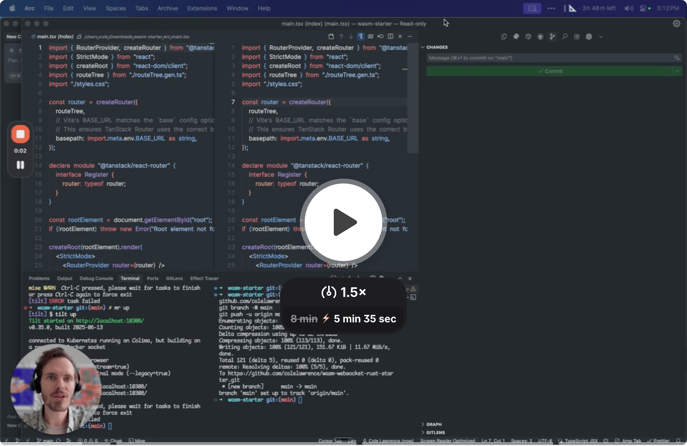

# WASM Pathfinder Starter

A starter project that uses Rust/WASM with `wasm-bindgen` and `petgraph` for shortest path computation, and D3.js for visualization.

Quick Loom demo and Overview:

[](https://www.loom.com/share/745c225bf0f44aaea4fab6c77e74c1a4)

## Quick Start

1. Install `mise`:
```bash
curl https://mise.run | sh
# or: brew install mise
```

2. Trust and install:
```bash
mise trust
mise install    # Installs Rust, Bun, Tilt, wasm-pack, etc.
```

3. Start development:
```bash
mise run tilt
```

That's it! This starts the full development environment with WASM auto-rebuild, Vite dev server, and WebSocket server.

## Development Commands

```bash
# Start full dev environment (recommended)
mise run tilt         # or: tilt up
mise run tilt:down    # Stop all resources

# Manual development (if not using Tilt)
mise run dev          # Vite dev server only
mise run server       # WebSocket server only
mise run wasm:watch   # Auto-rebuild WASM on changes

# Building
mise run build        # Production build
mise run wasm:build   # Build WASM only

# Type checking & testing
mise run typecheck    # Check TypeScript types
cargo test            # Run Rust tests
bun test              # Run TypeScript tests
```

## Project Structure

- `src-rust/` - Rust WASM transport layer
- `pathfinder-core/` - Pure pathfinding logic (transport-agnostic)
- `pathfinder-server/` - WebSocket transport server
- `shared-types/` - Protocol definitions and router infrastructure
- `src/` - React/TypeScript frontend
- `src/router/` - Transport-agnostic router with WASM and WebSocket adaptors
- `src/pathfinder.tsx` - D3.js visualization with transport switching
- `pkg/` - Generated WASM module (auto-generated)
- `docs/` - Project documentation
  - `architecture/` - System design and crate structure
  - `development/` - Codegen and development guides
  - `features/` - Feature documentation
  - `proposals/` - Design proposals and RFCs

## How It Works

1. Rust computes the shortest path between points using Dijkstra's algorithm from the `petgraph` library
2. The result is serialized and sent to JavaScript via wasm-bindgen
3. D3.js visualizes the graph and highlights the shortest path
4. Points are draggable, and the path recalculates in real-time
